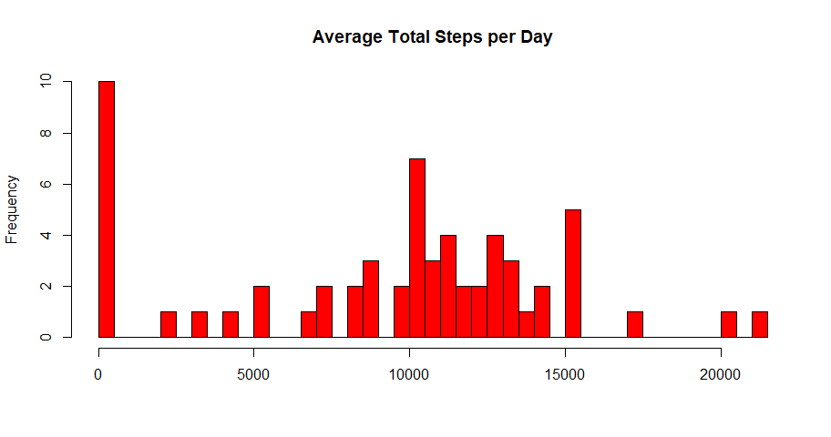
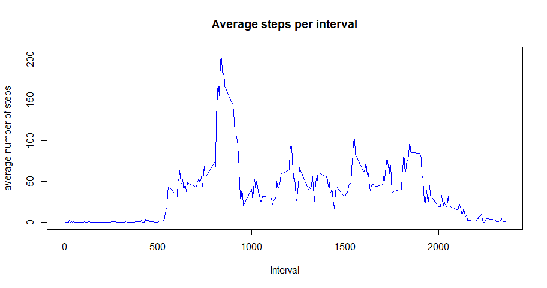
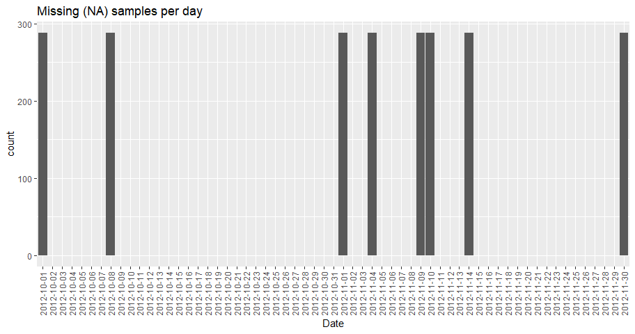
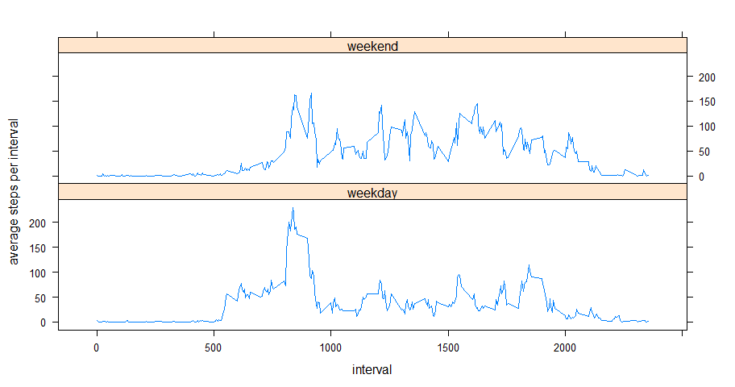

## Loading and preprocessing the data

```r
library(data.table)
library(ggplot2)
library(lubridate)
library(lattice)

df <- read.csv( unzip( "repdata_data_activity.zip") )
dt <- data.table( df ) 
```

## What is mean total number of steps taken per day?

```r
dailyStepTotal <- dt[,list( total=sum(steps,na.rm=TRUE) ), by=date] 
hist( x=dailyStepTotal$total, breaks=nrow(dailyStepTotal), xlab="", 
      main="Average Total Steps per Day", col="red" )
```

<!-- -->

```r
mean(dailyStepTotal$total) 
```

```
## [1] 9354.23
```

```r
median(dailyStepTotal$total)
```

```
## [1] 10395
```

## What is the average daily activity pattern?

```r
avgStepsPerInterval <- dt[,list( mean=mean(steps,na.rm=TRUE) ), by=interval] 
plot( x=avgStepsPerInterval$interval, y=avgStepsPerInterval$mean, 
       type="l", xlab="Interval", ylab="average number of steps",
       main="Average steps per interval", col="blue")
```

<!-- -->

## Imputing missing values

Calculate number of missing samples:


```r
sum( is.na(df$steps) )
```

```
## [1] 2304
```

Plot of missing samples per day:


```r
daily_NA_count <- dt[,list( NA_count=sum( is.na(steps) )), by=date] 
ggplot( data=daily_NA_count, aes(x=date, y=NA_count)) +
    geom_bar(stat="identity") +
    labs( title="Missing (NA) samples per day", x="Date", y = "count") +
    theme( axis.text.x=element_text(angle=90,hjust=1,vjust=0.5))
```

<!-- -->

The expected number of 5 minute samples per day is 24*60/5 = 288, which equals the height of the bars in the above plot. This means there are 8 days without any samples. One method to impute these missing days is to use the average daily activity pattern.


```r
summary(df)
```

```
##      steps                date          interval     
##  Min.   :  0.00   2012-10-01:  288   Min.   :   0.0  
##  1st Qu.:  0.00   2012-10-02:  288   1st Qu.: 588.8  
##  Median :  0.00   2012-10-03:  288   Median :1177.5  
##  Mean   : 37.38   2012-10-04:  288   Mean   :1177.5  
##  3rd Qu.: 12.00   2012-10-05:  288   3rd Qu.:1766.2  
##  Max.   :806.00   2012-10-06:  288   Max.   :2355.0  
##  NA's   :2304     (Other)   :15840
```

```r
imputed_df <- df;  # make copy of original data frame
for( i in seq_len(nrow(imputed_df)) )
{
    if( is.na(imputed_df[i,]$steps) )
    {
        imputed_df[i,]$steps <- avgStepsPerInterval[
                imputed_df[i,]$interval == avgStepsPerInterval$interval, ]$mean 
    }    
}  
summary(imputed_df)
```

```
##      steps                date          interval     
##  Min.   :  0.00   2012-10-01:  288   Min.   :   0.0  
##  1st Qu.:  0.00   2012-10-02:  288   1st Qu.: 588.8  
##  Median :  0.00   2012-10-03:  288   Median :1177.5  
##  Mean   : 37.38   2012-10-04:  288   Mean   :1177.5  
##  3rd Qu.: 27.00   2012-10-05:  288   3rd Qu.:1766.2  
##  Max.   :806.00   2012-10-06:  288   Max.   :2355.0  
##                   (Other)   :15840
```


## Are there differences in activity patterns between weekdays and weekends?

Here average steps-per-interval are ploted for weekdays and weekends:


```r
# create weekend/weekday factor
periods <- wday( ymd( as.character(imputed_df$date))) %in% c(1, 7)
imputed_df$period <- as.factor(ifelse(periods,"weekend","weekday"))

# average steps by interval and period
imputed_dt <- data.table( imputed_df ) 
avgStepsPerIntervalPeriod <- imputed_dt[,list( avg=mean(steps) ), by=c("period","interval")] 

xyplot( avg ~ interval|period, data=avgStepsPerIntervalPeriod,
        layout=c(1,2), type = "l", ylab="average steps per interval" )
```

<!-- -->

